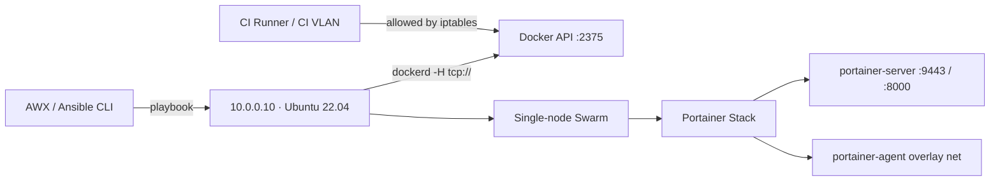

# Docker Swarm + Portainer via Ansible

[](https://github.com/maxuver/docker-swarm-portainer-ansible/actions/workflows/ci.yml)
[](LICENSE)
[](https://docs.ansible.com/)

Idempotent Ansible roles that provision a **single-node Docker Swarm** with the
Docker API exposed over TCP for CI/CD deploys, and deploy **Portainer CE** as
a stack on top of it for UI management.

## Architecture



## What's inside

```
ansible/
├── inventory/hosts.ini.example     # sample inventory
├── group_vars/all.yml              # all tunables: swarm + portainer
├── playbook.yml                    # main entry-point
├── requirements.yml                # external collections
└── roles/
    ├── docker_swarm/               # install Docker CE, swarm init, TCP API
    └── portainer/                  # docker stack deploy + health check
```

## Prerequisites

- Ubuntu 22.04 LTS host (root SSH).
- Ansible 2.15+ on the controller.
- `community.docker` and `ansible.posix` collections — installed via `requirements.yml`.
- Network ACL: ports 22, 2375 (CI VLAN only), 9443 and 8000 reachable from your CI/QA segment.

## Usage

```bash
# 1. Copy and edit the inventory
cp ansible/inventory/hosts.ini.example ansible/inventory/hosts.ini
$EDITOR ansible/inventory/hosts.ini

# 2. Install collections
ansible-galaxy collection install -r ansible/requirements.yml

# 3. Run
ansible-playbook -i ansible/inventory/hosts.ini ansible/playbook.yml
```

## Verification

```bash
# Docker API reachable from CI VLAN only
docker -H tcp://10.0.0.10:2375 info | head

# Swarm up
docker -H tcp://10.0.0.10:2375 node ls

# Portainer up
curl -k https://10.0.0.10:9443/api/system/status | jq .
```

## Idempotency note

After the first provisioning run, base roles (apt sources, sysctl, swap-off,
docker_ce installation) can be commented out in `playbook.yml` — rerunning
them on a healthy swarm host risks restarting the Docker daemon during
working hours. Uncomment only when provisioning a brand-new stand from scratch.

## License

MIT — see [LICENSE](LICENSE).
